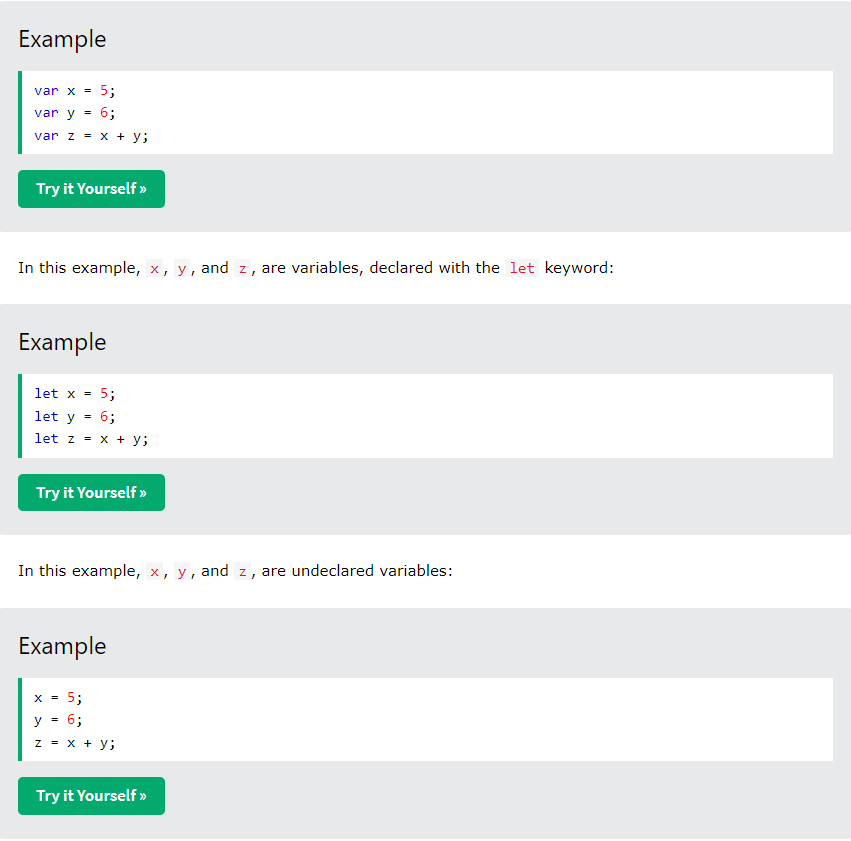
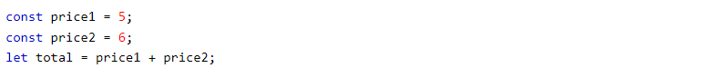

## OMG its Javascript

### Javascript

Javascript is a just in time compiled programming language with first class function.

## Applications that use JS

- Node.js

- Apache CouchDB

- Adobe Acrobat

## JavaScript Standards?

The standard for JavaScript are the ECMAScript Language Specification (ECMA-262 )

or

ECMA Internationalization API specification (ECMA-402)

## JavaScript vs Java?

There is a difference between Java and Javascript they are widely different in semantics and syntax!

## Example Code

 < html >
 < head >
  < title >Hello World</title>
< /head >
< body >
 
First name: < input id="first_name" >
Last name: < input id="last_name" >
< button id="say" >Say hi!< /button >
 
< hr >
< div id="result" >< /div >
 
< script >
function say_hi() {
    var fname = document.getElementById('first_name').value;
    var lname = document.getElementById('last_name').value;
 
    var html = 'Hello <b>' + fname + '</b> ' + lname;
 
    document.getElementById('result').innerHTML = html;
}
document.getElementById('say').addEventListener('click', say_hi);
</script>
 
</body>
</html>

All of this code creates a to add your name.

It uses functions and variables to distinguish what will happen!

## The juicy part of Javascript

### Variables

Variables are containers for storing data! Storing data values!

can be defined by the **let** keyword

or

**var** keyword

### **Examples**

## **CONST?**

Used for generalizing a declaration before code!

If you want a general rule: always declare variables with const.

If you think the value of the variable can change, use let.

The two variables price1 and price2 are declared with the const keyword.

These are constant values and cannot be changed.

The variable total is declared with the let keyword.

This is a value that can be changed.

## **Identifiers**

All Javascript variable must be identified with unique names!

### Rule for identifiers! :)

- Names can contain letters, digits, underscores, and dollar signs.

- Names must begin with a letter

- Names can also begin with $ and _ (but we will not use it in this tutorial)

- Names are case sensitive (y and Y are different variables)
- Reserved words (like JavaScript keywords) 
cannot be used as names

### Data Types

Javascript can handle all types of data typed of letters to numbers!

You can declare many variables in one statement.

Start the statement with let and separate the variables by comma:

[Back to Home](https://zusolaris.github.io/reading-notes/)
