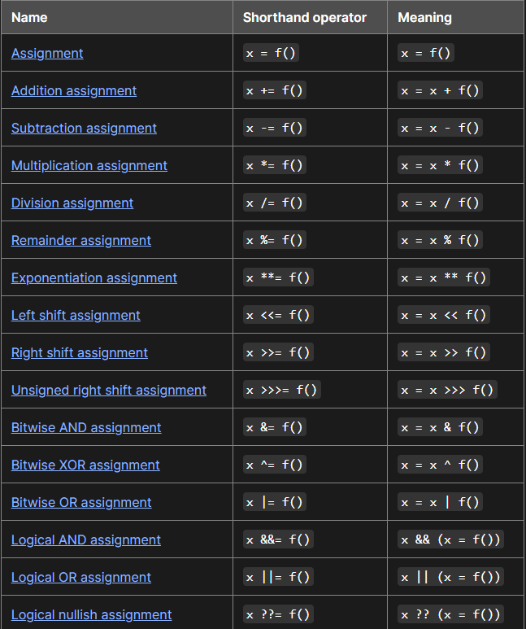
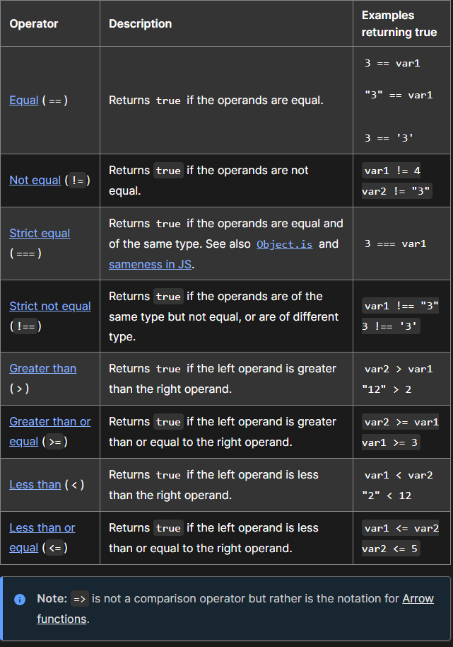

# Operators and Loops

## Expressions and Operators 

An expression is a valid unit of code that resolves to a value.

There two types those that assign and those that evaluate!

## Assignment Operators

Here are all the types!

An assignment operator assigns a value to its left operand based on the value of its right operand. The simple assignment operattor is equal (=), which assigns the value if its right operand to its left operand. 

## Assigning to properties

If an expression evaluates to an object then the left hand side of an assignment expression may make assignments to properties of that expression

const obj = {};

obj.x = 3;

console.log(obj.x); // Prints 3.

console.log(obj); // Prints { x: 3 }.

const key = "y";

obj[key] = 5;

console.log(obj[key]); // Prints 5.

console.log(obj); // Prints { x: 3,

 y: 5 }

 ## Destructuring 

For more complex assignments, the destructuring assignment syntax is a JavaScript expression that makes it possible to extract data from arrays or objects using a syntax that mirrors the construction of array and object literals.

## Evaluation and nesting

Assignments are used with variable declarations

Such as 

- const

- let

- var

Like other expression assignment expressions such as x=f() can evaluate into a result value.

Although it is not usually used. it can be used in another expression!

Chaining and nesting is unpredictable so it is not recommended!

The evaluation result matches the expression to the right of the = sign in the "Meaning" column of the table above. That means that x = f() evaluates into whatever f()'s result is, x += f() evaluates into the resulting sum x + f(), x **= f() evaluates into the resulting power x ** y, and so on.

In the case of logical assignments, x &&= f(), x ||= f(), and x ??= f(), the return value is that of the logical operation without the assignment, so x && f(), x || f(), and x ?? f(), respectively.

When chaining these expressions without parentheses or other grouping operators like array literals, the assignment expressions are grouped right to left (they are right-associative), but they are evaluated left to right.

## Comparison Operators 

A comparison operator compares its operands and returns a logical value based on whether the comparision is true!

It can be an integer, string, logical, or object value!

## for statement

A for loop repeats until a specified condition evaluates to false. The JavaScript for loop is similar to the Java and C for loop.

for ([initialExpression]; [conditionExpression]; [incrementExpression])
  statement'

## while Statement

A while statement executes its statements as long as a specified condition evaluates to true. A while statement looks as follows:

while (condition)
  statement

  [Back to Home](https://zusolaris.github.io/reading-notes/)
