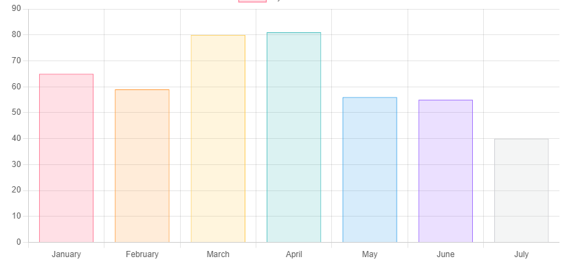
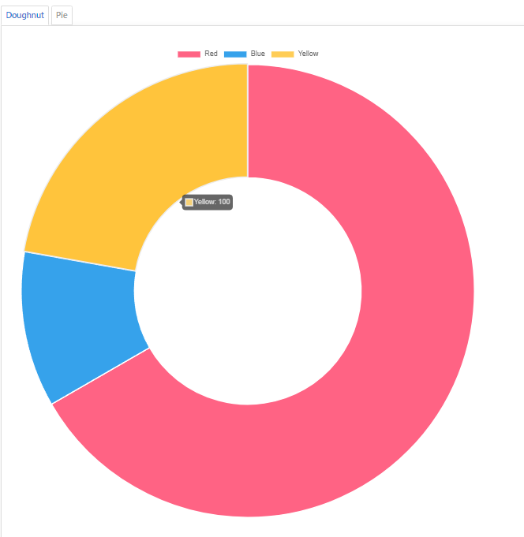
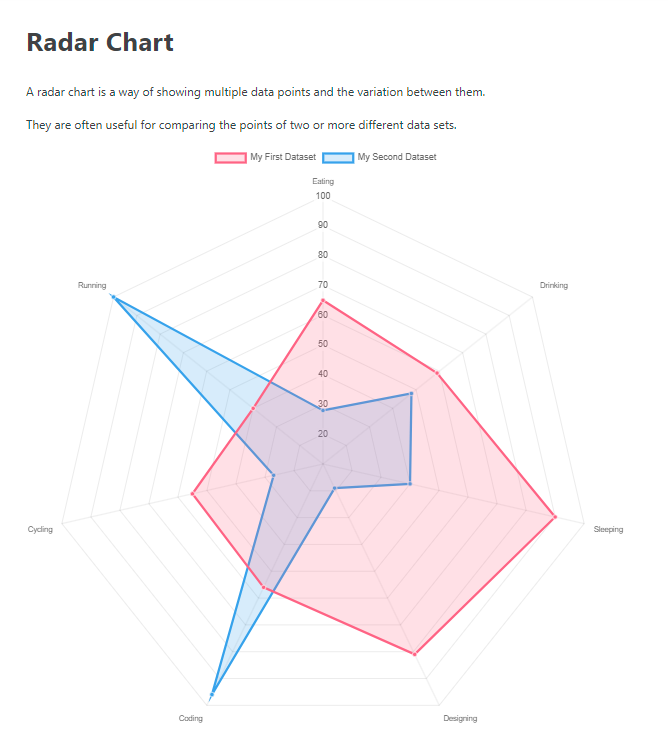

# Reading Assignment 11

## JavaScript Canvas
Source: https://www.javascripttutorial.net/web-apis/javascript-canvas/

**What does the *canvas* allow a developer to achieve?**
The canvas element in HTML allows a developer to add a drawable 2D canvas with Javascript!

**What is the importance of the closing *canvas* tag?**
The closing canvas tag is important in order to include fallback content. In the event that the canvas feature isn't supported in a browser.

**Explain what the getContext() method does.**

The getcontext() method takes one argument which is the context you wish to use. In the example below the context is 2D but once you get the applicable context you can use it to draw shapes, text, and many objects!

    let canvas = document.querySelector('#canvas');

    let ctx = main.getContext('2d');

## Chart.js Documentation

Source: https://www.chartjs.org/docs/latest/getting-started/usage.html

**What is Chart.js and how it can be brought into your project?**
Chart js is a Javascript library used to make and render charts onto projects.
To create a chart one must bring up the chart class and identify it in the canvas element.

    <  canvas id="myChart" width="400" height="400"></  canvas  >

**List 3 different Chart types you can create using Chart.js.**

## **Bar Charts**

## **Donut and Pie Charts**

## **Radar Chart**

## Easily Create Stunning Animated Charts with Chart.js

**What are some advantages to displaying data via a chart over a table?**
They can convey numbers and data things company strive off of and make them meaningful and easy to read in a chart. 

**How could Chart.js aid your previously created applications visually?**

They could have converted my salmon cookies stand into a visually appealing statistic site for the customer and not just a data heavy page that only data buffs would care about. It also would have probably made it easier to see what kind of stores where performing better than justby doing the math. It also would've made the data more digestable considering how random each page refresh was.

[Back to Home](https://zusolaris.github.io/reading-notes/)