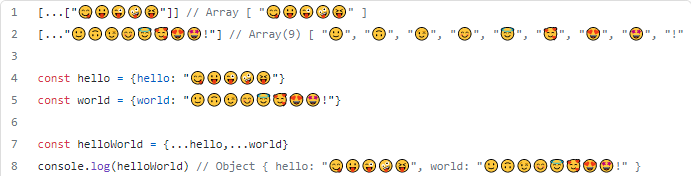
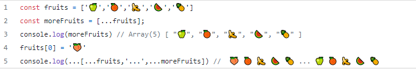
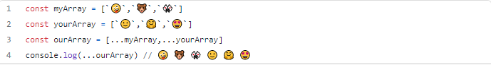

# Reading Assignment 3

## Reading

### React Docs - lists and keys

<https://reactjs.org/docs/lists-and-keys.html>

**What does .map() return?**
This function takes every item in it's assigned array and applys whatever assigned function.

**If I want to loop through an array and display each value in JSX, how do I do that in React?**

You could use the .map() method and use a return statement in React.

**Each list item needs a unique ___.**

KEY!

**What is the purpose of a key?**

A “key” is a special string attribute you need to include when creating lists of elements.

## The Spread Operator

**What is the spread operator?**

JavaScript, spread syntax refers to this thing >>> (…) to expand an object into the list of arguments.

**List 4 things that the spread operator can do.**

- bAdding an item to a list
- Adding to state in React
- Combining objects
- Converting NodeList to an array

Following images are credited to: https://medium.com/coding-at-dawn/how-to-use-the-spread-operator-in-javascript-b9e4a8b06fab

**Give an example of using the spread operator to combine two arrays.**

**Give an example of using the spread operator to add a new item to an array.**

**Give an example of using the spread operator to combine two objects into one.**

## How to Pass Functions Between Components

Video Source: https://www.youtube.com/watch?v=c05OL7XbwXU

**In the video, what is the first step that the developer does to pass functions between components?**

Ensure that the function is created at the same level of the state to ensure that the function can change the state.

**In your own words, what does the increment function do?**
The increment function redefines the people in the array goes through each of their state using the .map() method, if the name selected concurs with the associated key, an increment will be applied to the counter.

**How can you pass a method from a parent component into a child component?**

You must pass it along as a prop!

**How does the child component invoke a method that was passed to it from a parent component?**
You reference it using this.props and the component you wish to call. In the video they use an event handler and an On click function. 

[Back to Home](https://zusolaris.github.io/reading-notes/)

