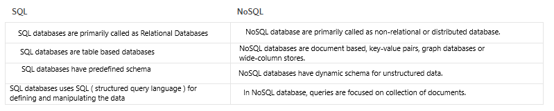

## Reading Assignment Page 11

**What kind of data is a good fit for an SQL database?**

SQL databases are good for storing and processing structured data.

**Give a real world example.**

Integer data, character data, monetary data, date and time data, binary strings

**What kind of data is a good fit a NoSQL database?**

hierarchical data storage as it follows the key-value pair way of storing data similar to JSON data.

**Give a real world example.**

Documents, key-value, wide-column, and graphs

**Which type of database is best for hierarchical data storage?**

NoSQL databases are a better for this type of data storage.

**Which type of database is best for scalability?**

SQL databases are much more efficent in the larger terms of scale.

## SQL vs NoSQL

**What does SQL stand for?**

Structured Query Language

**What is a relational database?**

A relational database is a type of database that stores and provides access to data points that are related to one another.

**What type of structure does a relational database work with?**

They work with logical data structures 

**What is a ‘schema’?**

 A database schema is considered the “blueprint” of a database which describes how the data may relate to other tables or other data models.

**What is a NoSQL database?**

NoSQL databases (aka "not only SQL") are non-tabular databases and store data differently than relational tables.

**How does it work?**

NoSQL databases simplify application development, particularly for interactive real-time web applications, such as those using a REST API and web services.

**What is inside of a MongoDB database?**
Instead of tables mongo DB stores its data in collections.

**Which is more flexible - SQL or MongoDB? and why.**

MongoDB has greater scalability and its has compatibility to read between both SQL and Non SQL data types.

**What is the disadvantage of a NoSQL database?**

The vertical scaling of No SQL will eventually reach a limit at some point. 

