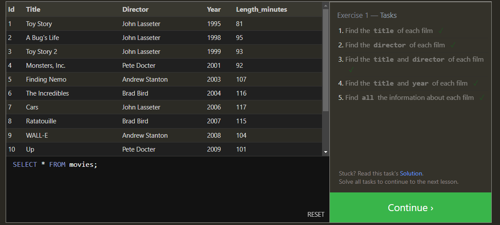
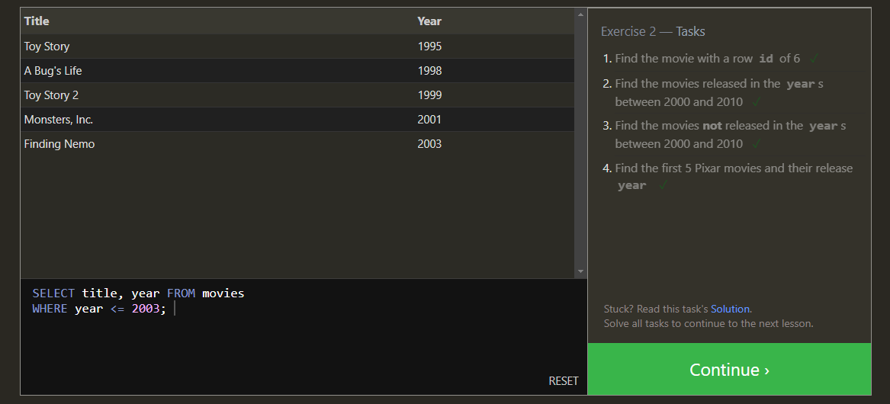
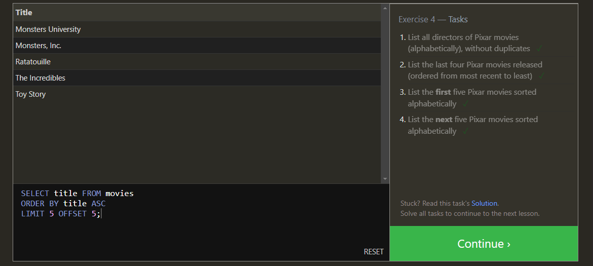
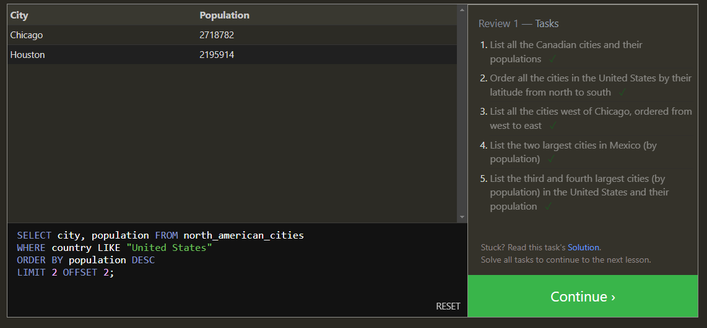
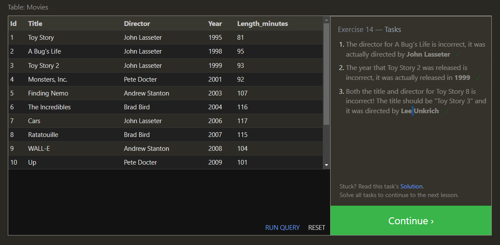
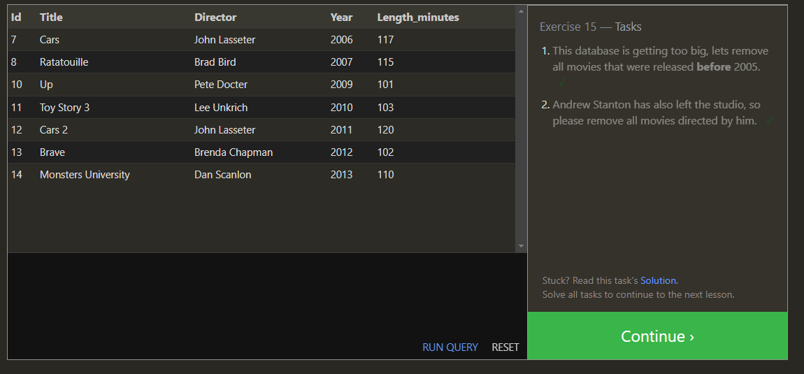
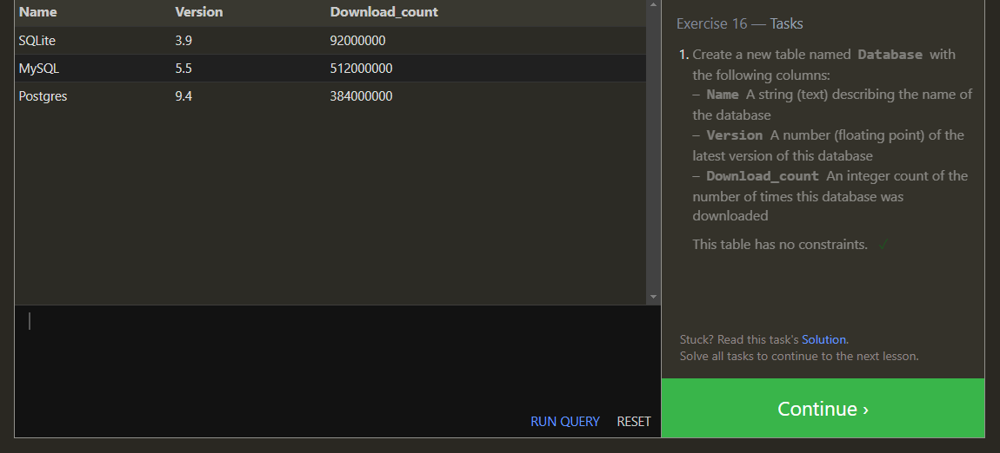
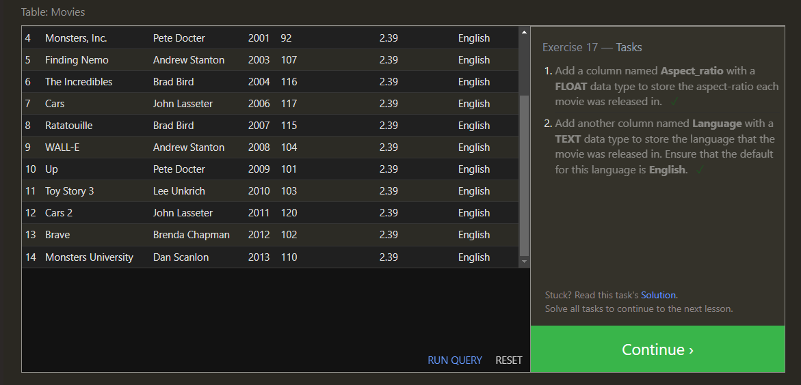
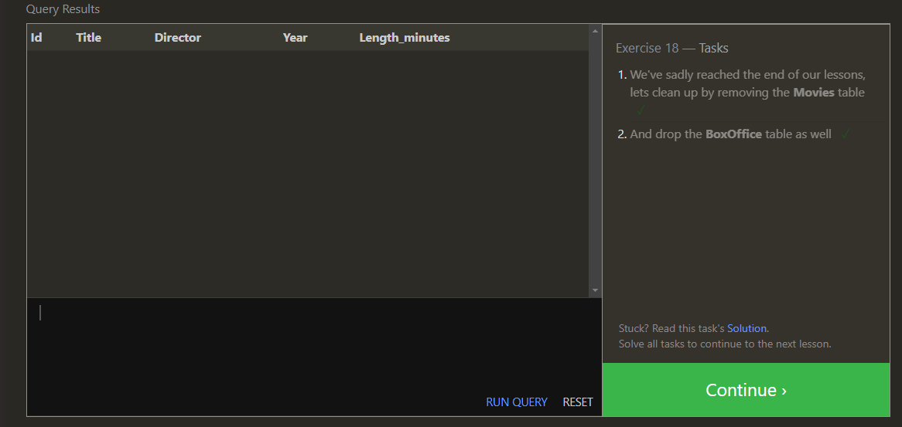

# SQL

Lesson 1

Lesson 2

Lesson 3

Lesson 4

Lesson 5

Lesson 6

Lesson 13

Lesson 14

Lesson 15

Lesson 16

Lesson 17

Lesson 18

## Relational Databases vs Non Relational Databases

### Relational Database Understanding

A relational database stores data within tables and rows, which get are also called records. They link information and assign through the usage of keys. They can be relational meaning that there is a primary key which is added to the record of another table. When referencing that key in another table this key becomes a foreign key. The primary key and foreign key relation creates the 'relational' database. Perfect for structured data types, and makesfaster query response times.