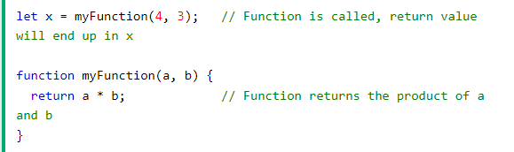
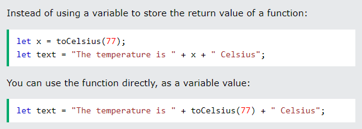
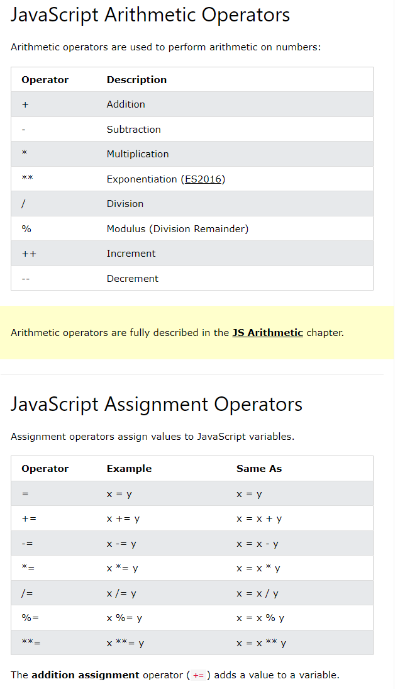
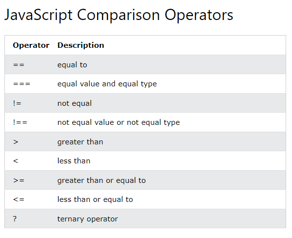

## Javascript Programming Reading

###**Control Flow**

The control flow is the order in which the computer executes statements in a script.

*(HOW THE PC READS CODE AND WHICH ORDER)*

## Example below:
The *if* function will go first followed by the else due to rules and conditional structures!

**if** (isEmpty(field)) {

*promptUser*();

} **else** {

submitForm();

}

Javascript includes many control structures and conditionals

- Loops

- Functions!

Parts of a script may also be set to start events when they happen!

Control structures can dictate flows of how code and script run. **EVEN** if they are only a few lines long.

## Javascript Functions 

> Javascript function is a block of code designd to peform a particular task.

*A javaScript function is executed when it gets trigged by something or called!*

## Function Syntax

A JavaScript function is defined with the function keyword, followed by a **name**, followed by parentheses **()**.

**Names** can contain letters, digits, under scores, and dollar signs (same rules as variables!)

Paratheses can include parameter names by seperating them with commas. 

## Function Invocation

The code inside the function will execute when "something" invokes **(calls)** the function.

- When an event occurs (when a user clicks a button)
- When it is invoked (called) from JavaScript code
- Automatically (self invoked)

**Example of Function Returns**

## Why Use functions?

You can reuse code: Define the code once, and use it many times.

You can use the same code many times with different arguments, to produce different results.

Accessing a function without () will return the function object instead of the function result.

## Functions Used as Variable Values

Function used as variable values!

Functions can be used the same way you use

## Types of Javascript Operators!

**Assignment** 

let x = 10;

**Adding**
let x = 5;
 
let y= 2;

let z = x+y;

**Multiplying**

let x = 5;

let y = 2;

let z = x * y;

## JavaScript String Operators

The + operator can combine string! 

let text1 = "John";

let text2 = "Doe";

let text3 = text1 + " " + text2;

## Adding Strings and Numbers

let x = 5 + 5;

let y = "5" + 5;

let z = "Hello" + 5;

Javascript Comparison Operators

[Back to Home](https://zusolaris.github.io/reading-notes/)

