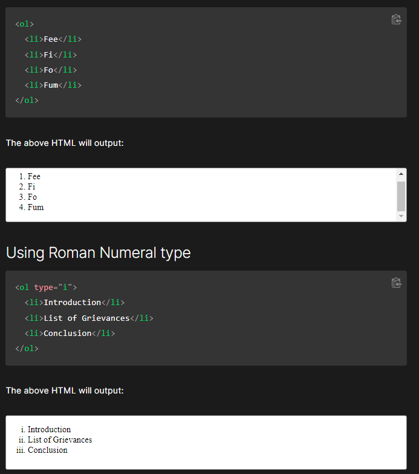

# Reading Assignment #3

## HTML...Continued....Again?

### Ordered and Unordered Lists 

* **When should you use an unordered list in your HTML document?**

You should use an unordered list can be used for a list that is not numbered but rather a list of items!

* **How do you change the bullet style of unordered list items?**

That property is not defined in HTML, but is accessed via HTML in using the list-style-type property.

* **When should you use an ordered list vs an unorder list in your HTML document?**

ol and ul elements both provide lists in an interchangable fashion. HOWEVER. You cannot make the lists meaningful if it is unordered.

* **Describe two ways you can change the numbers on list items provided by an ordered list?**

 Image Source (https://developer.mozilla.org/en-US/docs/Web/HTML/Element/ol)

## CSS...Continued....Again?

* **Describe the CSS properties of margin and padding as characters in a story. What is their role in a story titled: “The Box Model”?**
### 'The Box Model'

  >There was once a place called Website-opolis, that always had beings named "contentians" coming in and out it was ever changing. This was made possible by the Box Model Population Control Group or BMPCG. **Margin is a stealthy one, always on impostor watch he PUSHES away any other contentians that didn't belong . They lived in the very outer layer made sure all was in order wrapping it together in one, a truly symbiotic relationship between the team.** Border was like a second line of defense however wrapping the inner contentians without padding. **Padding was very important they worked hard and hand in hand with the contentians to make sure traffic would flow in and out smoothly and kept them in check in so they didn't hit each other they always wears an invisbility cloak.** Then actually came "El Content" the organizer, the overseer of the content, they are like the mayor (I guess...?) they have the ability to set and stretch the contentians as they pleased. Together they are the BMPCG and to this day they work non-stop 24/7.

**List and describe the four parts of an HTML elements box as referred to by the box model.**

* **Content:** Its where text and media are displayed.
* **Padding:** Creates an area for the content. It is invisible.

* **Border:** order surrounds the padding and content.
* **Margin:** Clears out the area around the border. Invisible as well.

* **What data types can you store inside of an Array?**
You can store variables, and then define those variables to contain integers or strings.

## JavaScript...Continued....Again?

* **Is the people array a valid JavaScript array? If so, how can I access the values stored? If not, why?**

Yes the people array is a valid Javascript Array, in order to access the data inside. You need to use the indexOf(.) phrase to access individual objects. If not you can use the for and of phrases as shown below.

    const birds = ['Parrot', 'Falcon', 'Owl'];for (const bird of birds) {
  console.log(bird);
}
source: https://developer.mozilla.org/en-US/docs/Learn/JavaScript/First_steps/Arrays

* **List five shorthand operators for assignment in javascript and describe what they do.**

*	**Assignment:** x = f() The simple assignment operator (=) is used to assign a value to a variable. The assignment operation evaluates to the assigned value. Chaining the assignment operator is possible in order to assign a single value to multiple variables.
* **Addition Assignment:** x+=f() The addition assignment operator (+=) adds the value of the right operand to a variable and assigns the result to the variable. The types of the two operands determine the behavior of the addition assignment operator. Addition or concatenation is possible.

* * **Subtraction Assignment:** 	x -= f() The subtraction assignment operator (-=) subtracts the value of the right operand from a variable and assigns the result to the variable.

* **Multiplication assignment** x = f() The multiplication assignment operator (*=) multiplies a variable by the value of the right operand and assigns the result to the variable.

* **Division assignment (/=)** 	x /= f() The division assignment operator (/=) divides a variable by the value of the right operand and assigns the result to the variable. The division assignment operator (/=) divides a variable by the value of the right operand and assigns the result to the variable.

definitions from (https://developer.mozilla.org/en-US/docs/Web/JavaScript/Guide/Expressions_and_Operators)
* **Read the code below and evaluate the last expression and explain what the result would be and why.**
  
  The expression would be 10dog! The boolean is not displayed because it only defined by true or false, it isn't used in this case.

       let a = 10;

      let b = 'dog';

      let c = false;

      // evaluate this
      (a + c) + b;

* **Describe a real world example of when a conditional statement should be used in a JavaScript program.**

A real example would be by providing an bonus to a wage if you did a certain amount of extra hours.

* **Give an example of when a Loop is useful in JavaScript.**

In my personal experience loops have been helpful when trying to get a specific phrase and not allowing the user to proceed unless that condition is met.

[Back to Home](https://zusolaris.github.io/reading-notes/)