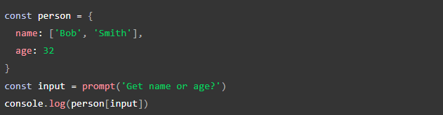

# JavaScript Object Basics

Source:<https://developer.mozilla.org/en-US/docs/Learn/JavaScript/Objects/Basics>

1. **How would you describe an object to a non-technical friend you grew up with?**

In order to understand what an object is we must understand what variables and functions are. So a function is when you define a word and give it instructions that it must follow to make it "move" or work then you have to call it to work. A variable is also a word but it strictly has a name at the given time, it be changed if you name it with let or it can stay permanently named if you name it with const. So now that you know what those are I can explain what an object is. So an object is a collection of these functions and variables and it basically becomes it's own thing! The functions and variables then become properties and methods. You can now store all of this information within one concise name and call it nice and conviently at any point!

2. **What are some advantages to creating object literals?**
A huge advantage of using literals is the abiility to transfer a series of structured and related data in a concise manner, rather than writing out all of the code. It makes everything more organized from databases and its much more effiecent than working with an array, when accessing them by name.
3. **How do objects differ from arrays?**
Objects exist by representing data in a simple and concise name while, arrays exist by creating storing lists within a variable.

4. **Give an example for when you would need to use bracket notation to access an object’s property instead of dot notation.**

If an object is defined at runtime, you can alternatively acess it through bracket notation. Example Below!

Image Source:(https://developer.mozilla.org/en-US/docs/Learn/JavaScript/Objects/Basics)

5. **Evaluate the code below. What does the term *this* refers to and what is the advantage to using this?**

const dog = {

    name: 'Spot',

    age: 2,

    color: 'white with black spots',

    humanAge: function (){

    console.log(`${this.name} is $
    
    
    {this.age*7} in human years`);
  
  
     }
    }

The term *this* refers to the dog it is directly referencing the object itself. Taking that data and inserting it into the called part of the code.

# Introduction to DOM!

Source: (https://developer.mozilla.org/en-US/docs/Learn/JavaScript/Objects/Basics)

1. **What is DOM?**

 DOM stands for Document Object Model, it is a programming interface for web documents. The DOM represents the document as nodes and objects; that way, programming languages can interact with the page.

2. **Briefly describe the relationship between the DOM and JavaScript.**

Javascript and DOM have a relationship that allows the page to work the way it does. Javascript reads Javascript but uses DOM to access content from the page. The DOM is not part of the JavaScript language, but is instead a Web API used to build websites. JavaScript can also be used in other contexts.DOM doesn't only have to interact with Java Script it can also be used to read other languages!

[Back to Home](https://zusolaris.github.io/reading-notes/)
